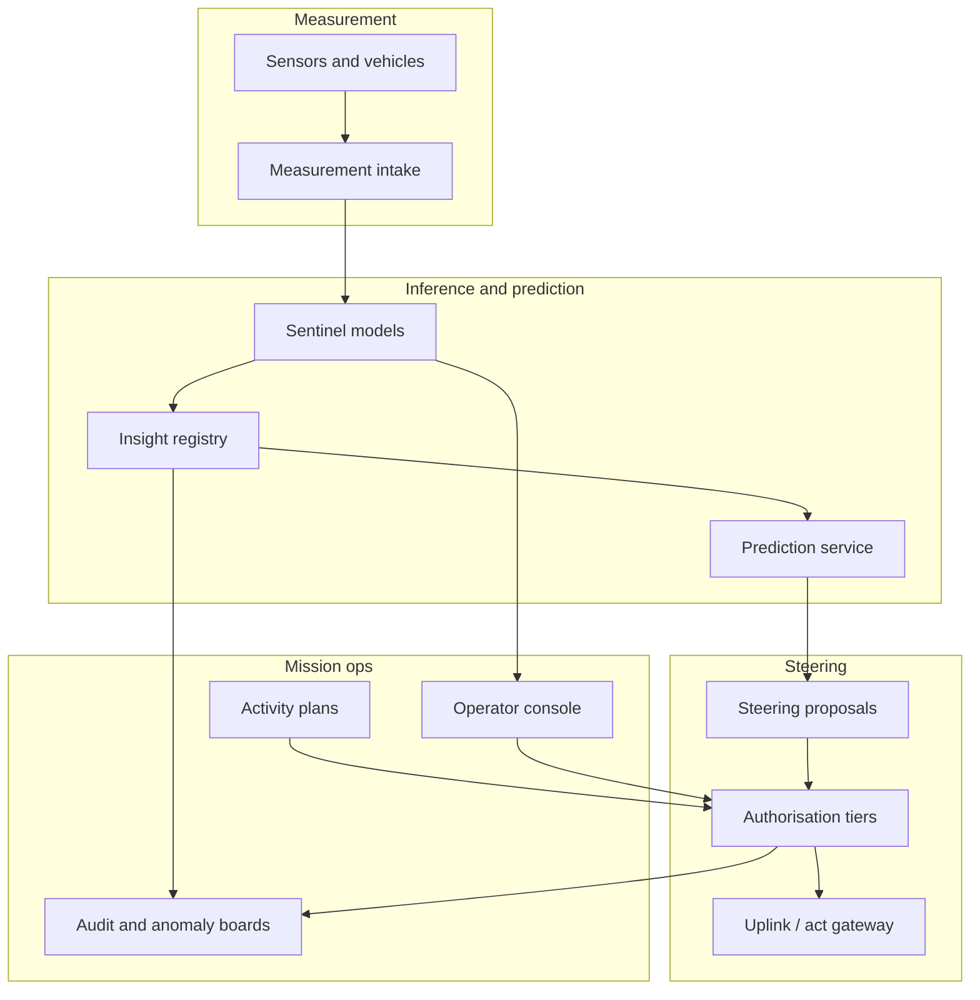

# Steercraft

**Source:** `ai-in-gov/ai_at_NASA/`
**Domain:** `ai-gov`
**One-liner:** A mission-operations loop that turns streaming sensor measurement into inference, prediction and authorised steering actions — so science and exploration teams get actionable intelligence from rovers, satellites and sentinels without drowning in combinatorial data growth.
**Wedge:** NASA and partner mission operations centres running remote-sensing, planetary surface and environmental-monitoring campaigns where human operators cannot close the OODA loop at data speed — starting with rover traverse/science planning and Earth science alert pipelines that already approximate Dynamic Data-Driven Application Systems (DDDAS).
**Positioning:** Mission ops for data-to-action. Dashboards stop at insight; Steercraft makes the *steering* step a first-class, auditable capability — Measurement → Inference → Prediction → Steering (MIPS) — with sentinel models at the point of collection trained to minimise false positives and alarm fatigue.

## Market research synthesis

### Thesis from source

The source is Kirk Borne’s Booz Allen Hamilton briefing “AI at NASA: From Data to Insights to Actionable Intelligence” (slides hosted as NASA-AI2018). Its framing is the scientific method under combinatorial data growth: evidence answers questions, which spawn more questions and more collection, until growth is no longer linear or merely exponential but combinatorial — “all possible interconnections, linkages, and interactions.” Data science (KDD), engineering design and AI are positioned as successive layers that convert that growth into something operators can act on. The brief insists that the real power of AI is not “artificial” but *Accelerated, Applied, Actionable, Assisted, Adaptable, Augmented, Amplified* intelligence — and that pattern recognition is the basis of both human and machine intelligence.

The operational spine is the progression from pattern discovery to pattern exploitation. Discovery alone is “easy”; exploitation requires generalisation — the Goldilocks model that captures the fundamental pattern and natural variance without overfitting. Four discovery types are named as the inventory of insights a mission system must support: class discovery (categories and boundary rules), correlation discovery (governing principles / “DNA”), outlier/anomaly/novelty/surprise discovery, and association/link discovery on graphs. Concrete examples move from retail association rules to hurricane intensification forecasting where association-rule prediction outperformed National Hurricane Center baselines, and to graph semi-metric insights that reveal hidden links never present as rows in a transactional store — research discovery across disconnected journals, safety-incident causal factors, fraud and trafficking networks.

Actionable intelligence is illustrated with Mars rovers: smart data gatherers that are autonomous decision systems for a data-informed journey, climbing the pyramid from data to information to knowledge to understanding to action. The operational pattern for any streaming sensor domain is Sensors → Sentinels → Sense: monitoring and mining actionable data; autonomous alerts via embedded ML at the point of collection, trained to minimise false positives and “alarm fatigue”; and smart sensors delivering actionable intelligence. The formal loop is DDDAS MIPS — Measurement, Inference, Prediction, Steering — equated to the military OODA loop (Observe–Orient–Decide–Act). Measurement spans satellite imagery, remote sensing, astronomical sky events, machine logs and national-security feeds; machine learning enables the Inference and Prediction steps via the four discovery types; Steering is action, including robotic process automation and physical autonomy. The closing challenge is explicit: train the AI to see the world in the ways humans do *and to act on that insight*.

The product that follows is not a generic NASA data lake. It is a mission-ops control surface for closing MIPS with governed steering — so insight does not die in a slide deck while the rover, satellite or environmental sentinel continues to collect combinatorial noise.

### Buyer & economic model

- **Primary buyer:** Mission Operations Manager or Principal Investigator with budget authority for a flight/science mission or multi-mission Earth science pipeline; co-buyer is the flight software / autonomy lead.
- **Users:** mission operators and science planners (daily), onboard/ground autonomy engineers (daily), data scientists building sentinel models (per campaign), anomaly duty officers (on-call), safety and planetary-protection reviewers (gates), archive and knowledge-graph curators (continuous).
- **Budget owner / value metric:** mission operations and science-return budget. The value metric is time from measurement to authorised steering action, false-positive rate of sentinel alerts (alarm fatigue), and science-return or hazard-avoidance outcomes attributable to steered actions versus manual review queues.
- **Competing status quo:** downlink → offline processing → PowerPoint/Jupyter insight → human meeting → command uplink days later; separate tools for telemetry, science planning and anomaly tickets; knowledge graphs and association mining run as research side projects that never write back into the command loop.

### Domain constraints

- **Regulatory / trust / safety:** planetary protection, spacecraft safety and human-spaceflight constraints where applicable; Earth science alerts that trigger public warning systems need false-positive discipline; autonomous steering must respect command authority and change-control for flight software.
- **Data sensitivity:** export-controlled spacecraft telemetry, scientifically valuable proprietary campaign data, and in Earth domains potentially privacy-affecting geospatial data; training data provenance must be retained for contested science claims.
- **Change-management realities:** flight projects distrust ungoverned autonomy; Steercraft must support human-approved steering tiers (recommend-only → supervised → bounded autonomy) and must integrate with existing mission control systems rather than replace them overnight.

## Business requirements

- BR-1: Every closed loop must be expressible as MIPS — Measurement, Inference, Prediction, Steering — with each stage timestamped and attributable.
- BR-2: Sentinel models deployed at or near collection must carry an explicit false-positive budget and alarm-fatigue KPI agreed by the mission before go-live.
- BR-3: Steering actions that affect vehicle state, instrument mode or public alert status require an authorisation tier matched to risk; recommend-only is the default.
- BR-4: The platform must support all four discovery types (class, correlation, anomaly, association/graph) as first-class insight objects linkable to predictions and steering proposals.
- BR-5: Generalisation quality must be reportable — holdout and drift metrics — so operators can see when a Goldilocks model has become overfit or stale.
- BR-6: Association and graph insights that imply links not present in tabular telemetry must show path evidence, so hidden links are contestable.
- BR-7: Mars-rover-class and satellite-class missions must be able to queue steering commands for uplink windows, with conflict detection against existing activity plans.
- BR-8: Alarm suppression and escalation rules must be configurable so that sentinel chatter cannot overwhelm the on-call operator.
- BR-9: All steered actions and suppressed alerts must be auditable for anomaly review boards and science peer review.
- BR-10: Knowledge-graph and repository assets used for insight must be citable (re-use, provenance) so discoveries remain reproducible.
- BR-11: The system must degrade gracefully when downlink is delayed — buffering measurements and clearly marking predictions made on stale measurement.
- BR-12: Commercial value for institutional buyers includes measurable reduction in mean time from alert to decision and increase in automated steering within approved bounds without raising safety incident rates.

## User stories

Canonical user stories live in sibling [USER_STORIES.md](USER_STORIES.md).

## System design

### Overview

Steercraft ingests measurement streams from sensors and mission buses, runs sentinel inference at the edge or ground, records discoveries and predictions, and proposes or executes steering within authorisation tiers. It is the MIPS control plane beside existing mission control: it does not replace command uplinks but structures when and why a steering action is allowed. Knowledge graphs and association engines feed insight objects; false-positive budgets govern sentinel promotion; audit trails support anomaly boards and science reproducibility.

### Actors & boundaries

- **Actors:** sensors/rovers/satellites, mission operators, PIs, autonomy engineers, duty officers, safety/planetary-protection reviewers, archive systems.
- **Trust boundary:** steering commands cross into vehicle/command systems only through authorised gateways; science archives receive citable products, not raw uncleared telemetry; model training environments are segregated by export-control tags.
- **Human-in-the-loop points:** sentinel promotion past recommend-only; approval of force/vehicle-risk steering; anomaly board disposition; public-alert release for Earth science.

### Core capabilities

1. **Measurement intake and sensor catalogue**.
2. **Sentinel model lifecycle with false-positive budgets**.
3. **Insight registry** (class, correlation, anomaly, association/graph).
4. **Prediction services with staleness marking**.
5. **Steering proposal, authorisation and uplink queueing**.
6. **Alarm suppression and escalation**.
7. **Activity-plan conflict detection**.
8. **Provenance and citation export**.
9. **Drift / generalisation monitoring**.
10. **Mission audit and anomaly-board packs**.

### Conceptual data

- **Primary entities:** Mission, SensorStream, Measurement, SentinelModel, Insight, Prediction, SteeringAction, AuthorisationTier, AlarmPolicy, ActivityPlan, ProvenanceRecord, DriftReport.
- **Critical events:** measurement received, sentinel fired/suppressed, insight registered, prediction issued, steering proposed/approved/executed/rejected, drift threshold breached.
- **Retention / audit needs:** full MIPS chain retained for mission lifetime plus review period; raw high-rate sensor data per existing mission archive policy; model lineage retained for reproducibility.

### Integrations (conceptual)

- **Systems of record:** mission control command/telemetry systems, science planning tools, planetary data archives / Earth data repositories, incident/anomaly ticketing.
- **Upstream signals:** onboard sensors, ground stations, external weather/hazard feeds, curated knowledge graphs.
- **Downstream actions:** command uplink queues, operator consoles, public alert gateways (Earth), archive deposits, retraining jobs.

### High-level architecture

### Success metrics

- **Leading:** median measurement-to-steering-proposal latency; sentinel false-positive rate versus budget; percentage of alerts suppressed with recorded rationale; share of predictions carrying staleness flags when downlink delayed.
- **Lagging:** mean time from alert to authorised decision; science-return or hazard-avoidance outcomes tied to steered actions; anomaly-board reopen rate for unexplained autonomous acts; reduction in operator alarm fatigue scores across campaigns.

## OpenAPI skeleton

Canonical HTTP surface lives in sibling [openapi.yaml](openapi.yaml). Summary:

- **Base path:** `/v1/...`
- **Auth:** `X-API-Key` for vehicle/ground data systems; Bearer JWT for operators and reviewers.
- **Resource groups:** Missions, Measurements, Sentinels, Insights, Predictions, Steering, Reporting.
