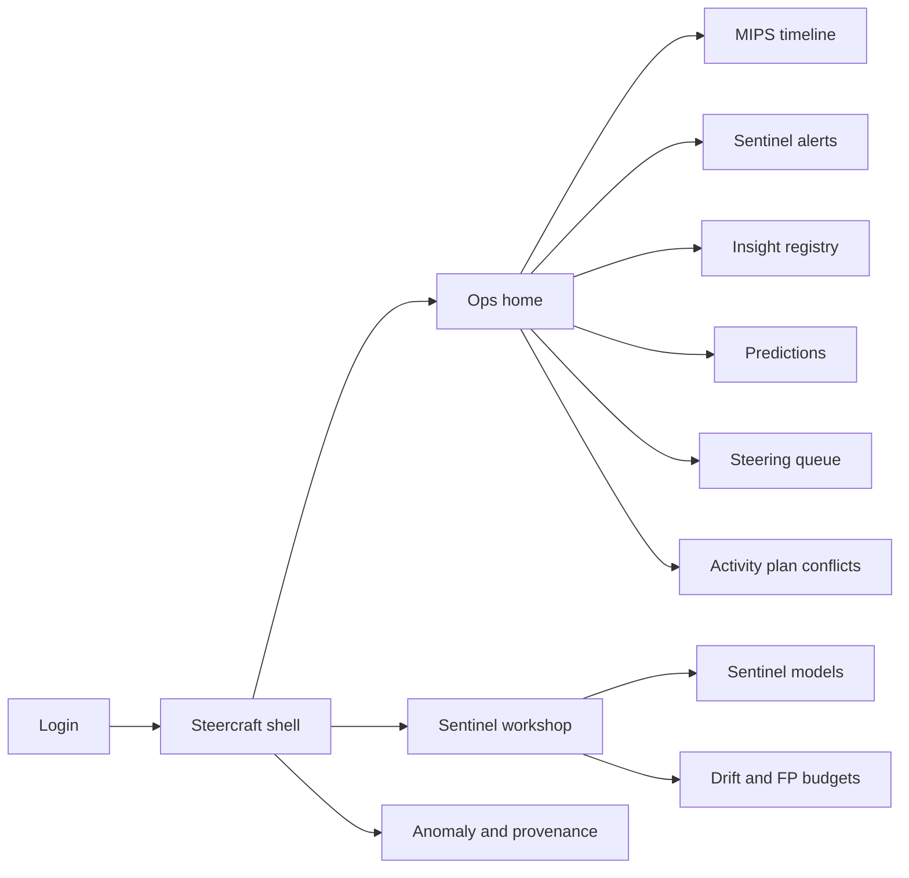
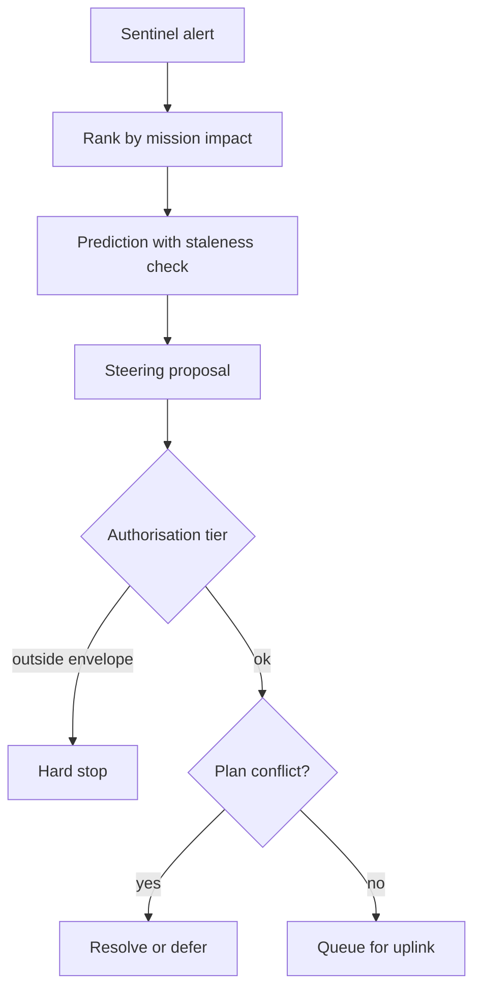

# Steercraft — Web app

**Product:** [PRODUCT.md](./PRODUCT.md)
**Primary surface:** Mission operations MIPS console (operators, science planners, autonomy engineers)
**Secondary surfaces:** Sentinel model workshop (false-positive budgets); anomaly-board evidence pack (read-only export); Earth-alert gateway status (when applicable)
**Design thesis:** Steercraft is a closed Measurement → Inference → Prediction → Steering loop, not a science dashboard that stops at pretty plots. The UI metaphor is a flight-director timeline: every alert and proposal sits on a MIPS chain with timestamps; sentinel models wear an explicit false-positive budget like a fuel margin; steering defaults to recommend-only and hard-stops outside its authorisation envelope. Visual language is deep-space charcoal with instrumentation cyan and caution amber — goldilocks models feel calibrated, stale predictions look aged, suppressed alarms remain auditable silence. The Steercraft wordmark sits as a quiet mission patch on every steering and audit screen.

## UX research synthesis

### Category peers (best-in-class)

- **NASA AMMOS / mission control planning tools (conceptual):** Activity plans, uplink windows, conflict awareness. Steal: plan-aware steering queues; reject replacing command systems wholesale.
- **JPL Open Source Rover / autonomy ground tools & similar ops UIs:** Traverse/science planning with human approval gates. Steal: proposal-with-justification before command; reject unsupervised autonomy as default.
- **Databricks / Vertex experiment + monitoring consoles (MLOps slice):** Drift, holdout, promotion gates. Steal: generalisation and drift chrome on every production sentinel; reject notebook-only insight graveyards.
- **PagerDuty / Opsgenie (alert discipline):** Suppression, escalation, fatigue management. Steal: false-positive budgets and auditable silence; reject alert fireworks as “AI value.”

### Patterns to adopt / reject

- **Adopt:** MIPS chain as the spine of every detail view; four insight types as first-class objects; staleness flags on predictions; authorisation tiers (recommend → supervised → bounded); uplink conflict detection; alarm suppression with rationale; citable provenance; export-control tags on features.
- **Reject:** Insight galleries without steering path; one-click vehicle commands from unranked ML scores; hidden suppressed alerts; purple “copilot” that invents uplink sequences; dashboard-of-everything hiding alarm fatigue.

### Trust, density, and workflow constraints from PRODUCT.md

Flight projects distrust ungoverned autonomy (BR-3): recommend-only default; bounded envelopes hard-stop. Alarm fatigue is a managed contract via false-positive budgets (BR-2, BR-8). Delayed downlink must mark stale predictions (BR-11). Graph/association insights need path evidence to be contestable (BR-6). Anomaly boards need full MIPS packs (BR-9). Steercraft sits beside mission control — it structures authorisation, not raw radio.

## Information architecture

### Nav model

### Roles → default home

| Role | Default home | Why |
|------|--------------|-----|
| Mission operator / science planner | Ops home — ranked alerts + steering proposals | Pass time on what matters (BR-1, BR-3) |
| Autonomy / data scientist | Sentinel workshop | FP budget and drift contracts (BR-2, BR-5) |
| Anomaly duty officer | Alerts + suppressed rationale | Auditable silence (BR-8, BR-9) |
| Safety / planetary-protection reviewer | Steering authorisation gates | Envelope hard-stops (BR-3) |
| PI / archive curator | Provenance and citations | Reproducible claims (BR-10) |
| Platform admin | Mission tiers and export-control tags | Mode isolation (admin stories) |

### Cross-links to OpenAPI resources

| Nav area | OpenAPI tags / resources |
|----------|---------------------------|
| Mission context | Missions |
| Sensor streams / intake | Measurements |
| Models, FP budgets, suppression | Sentinels |
| Class / correlation / anomaly / graph | Insights |
| Staleness-aware forecasts | Predictions |
| Proposals, auth, uplink queue | Steering |
| Drift, audit packs, citations | Reporting |

## Screen inventory

### Ops home

- **Purpose:** Rank sentinel alerts by predicted mission impact and surface steering proposals awaiting authorisation.
- **Entry:** Operator login default.
- **Layout regions:** Brand + mission switcher; MIPS health (measurement lag, sentinel FP vs budget); ranked alert list; proposals needing approval; stale-prediction count; plan-conflict badges.
- **Primary actions:** Open alert; approve/reject proposal; open suppressed list; jump to uplink window.
- **Empty / loading / error:** Quiet pass = “within FP budget, no ranked alerts”; downlink outage = coral measurement-lag banner.
- **BR / story ties:** BR-1, BR-2, BR-11; operator stories.

### MIPS timeline

- **Purpose:** Show Measurement → Inference → Prediction → Steering as one attributable chain for any event.
- **Entry:** From alert, proposal, or anomaly pack.
- **Layout regions:** Horizontal MIPS stages with timestamps and actors; links to insight objects; staleness markers; export for board.
- **Primary actions:** Expand stage evidence; pin to anomaly pack; cite provenance.
- **Empty / loading / error:** Broken chain = cannot authorise steering.
- **BR / story ties:** BR-1, BR-9.

### Sentinel alert console

- **Purpose:** Operate alerts under FP budget with suppression/escalation rules.
- **Entry:** Ops → Alerts; on-call.
- **Layout regions:** Active alerts; suppression queue with rationale; escalation ladder; FP burn vs budget meter.
- **Primary actions:** Acknowledge; suppress with reason; escalate; open steering proposal.
- **Empty / loading / error:** Budget exceeded = promote model review, not more sirens.
- **BR / story ties:** BR-2, BR-8.

### Insight registry

- **Purpose:** First-class class, correlation, anomaly, and association/graph discoveries linkable to predictions and steering.
- **Entry:** Insights nav.
- **Layout regions:** Type filters; insight detail; for graph types — path evidence panel; citation / DOI links.
- **Primary actions:** Register insight; link to prediction; contest path evidence; archive with provenance.
- **Empty / loading / error:** Graph insight without path = blocked publish.
- **BR / story ties:** BR-4, BR-6, BR-10.

### Predictions

- **Purpose:** Issue predictions with holdout/drift context and clear staleness when measurement is old.
- **Entry:** From insights or ops.
- **Layout regions:** Prediction list; staleness badge; linked insights; confidence vs drift report snippet.
- **Primary actions:** Create from insight; mark invalid; propose steering.
- **Empty / loading / error:** Stale measurement = amber “prediction on aged data.”
- **BR / story ties:** BR-5, BR-11.

### Steering queue and authorisation

- **Purpose:** Propose steering with risk-matched tier; default recommend-only; hard-stop outside envelope.
- **Entry:** Ops → Steer; proposal from prediction.
- **Layout regions:** Proposal list; tier badge; justification (insight/prediction links); envelope check; approve/reject; uplink queue position.
- **Primary actions:** Approve within tier; reject; request tier change via admin (not self-elevate); detect plan conflicts.
- **Empty / loading / error:** Outside envelope = coral hard-stop; conflict with activity plan = block until resolved (BR-7).
- **BR / story ties:** BR-3, BR-7, BR-12.

### Activity plan conflict board

- **Purpose:** Detect steered commands colliding with human-planned sequences before uplink.
- **Entry:** From steering block; Plans nav.
- **Layout regions:** Plan timeline; conflicting proposals; resolution options.
- **Primary actions:** Defer proposal; retarget window; cancel.
- **Empty / loading / error:** Empty = no conflicts.
- **BR / story ties:** BR-7.

### Sentinel workshop

- **Purpose:** Publish sentinels with explicit FP budget, alarm policies, and promotion gates.
- **Entry:** Autonomy engineer default.
- **Layout regions:** Model list; FP budget editor; promotion checklist (recommend-only first); export-control tags on features.
- **Primary actions:** Set budget; promote; retire; open drift report.
- **Empty / loading / error:** No FP budget = cannot go live.
- **BR / story ties:** BR-2, BR-5; data scientist stories.

### Drift and generalisation monitor

- **Purpose:** Show when Goldilocks models overfit or go stale before the vehicle acts wrongly.
- **Entry:** Workshop; ops warning.
- **Layout regions:** Drift charts; holdout metrics; retrain recommendations; affected predictions.
- **Primary actions:** Pause sentinel; schedule retrain; notify ops.
- **Empty / loading / error:** Missing metrics = demote to recommend-only.
- **BR / story ties:** BR-5.

### Anomaly board and provenance pack

- **Purpose:** Full MIPS chain for unexplained acts; citable provenance for science claims.
- **Entry:** Audit nav; board export.
- **Layout regions:** Case list; MIPS pack; suppressed-alert itemisation; citation export; repository DOI links.
- **Primary actions:** Open disposition; export pack; attach archive cite.
- **Empty / loading / error:** Incomplete chain = flagged for board.
- **BR / story ties:** BR-9, BR-10.

## Key flows

1. **Alert to authorised steering** — sentinel fires within FP budget → insight/prediction → proposal → tiered approval → uplink queue; failure: plan conflict or envelope hard-stop (BR-3, BR-7).

2. **Publish sentinel with FP contract** — train → set FP budget → recommend-only promote → supervised if approved → monitor drift (BR-2, BR-5).

3. **Suppress without losing audit** — chatter alert → suppress with rationale → itemised for duty officer (BR-8, BR-9).

4. **Stale downlink degradation** — delayed measurement → buffer → mark predictions stale → block high-risk steering or require explicit override (BR-11).

5. **Graph insight contest** — association discovery → show path evidence → register or reject → link to prediction (BR-6).

## Design system

### Tokens (CSS variables)

- `--color-ink: #E6EDF5` — primary text
- `--color-space-950: #070B12` — app ground
- `--color-space-900: #101826` — panels
- `--color-space-700: #2A3548` — rules
- `--color-cyan: #3EC6E0` — healthy measurement / authorised path
- `--color-amber: #E6A23C` — stale prediction / FP budget warning
- `--color-coral: #E85D4C` — envelope hard-stop / conflict
- `--color-steel: #8B9BB0` — secondary labels
- `--color-brand: #B7C9DC` — Steercraft wordmark (quiet instrument steel)
- `--font-display: "IBM Plex Sans", sans-serif` — mission titles (tight tracking)
- `--font-body: "IBM Plex Sans", sans-serif`
- `--font-mono: "IBM Plex Mono", monospace` — MIPS ids, command refs
- `--space-1`…`--space-8`: 4px scale
- `--radius-sm: 2px`; `--radius-md: 6px` — instrumentation sharp
- `--motion-mips: 220ms ease-in-out` — stage advance
- `--motion-stale: 300ms linear` — staleness fade
- `--motion-auth: 180ms ease-out` — approval stamp
- Atmosphere: faint starfield noise and horizontal instrument hairlines; no NASA meatball pastiche overload; no purple nebula AI clichés.

### Typography & brand

- Display for mission and stage titles; mono for command and measurement ids.
- Brand patch on steering and audit views; ops home keeps brand as strongest chrome mark.
- Login: brand hero; headline (“Close the loop. Steer with authority.”); one CTA — no vanity telemetry collage.

### Do / don’t

- **Do:** Show full MIPS; FP budget meters; staleness badges; hard-stop outside envelope; path evidence on graph insights.
- **Don’t:** Purple AI glow; unsupervised default; hide suppressed alerts; insight-without-steering graveyards; rounded-full consumer pills on flight controls.

### Accessibility & domain trust cues

- AA+ contrast; hard-stops use text + icon + optional audio in ops rooms.
- Live regions for FP budget breach and uplink conflicts.
- Focus order follows MIPS: measurement → sentinel → insight → prediction → steering.
- Provenance packs machine-readable for archive deposit.

## Component patterns

- **MipsChain** — four-stage attributable timeline.
- **FpBudgetMeter** — false-positive burn vs contract.
- **StalePredictionBadge** — aged measurement warning.
- **SteeringTierGate** — recommend / supervised / bounded with hard-stop.
- **PlanConflictBanner** — activity-plan collision.
- **InsightTypeCard** — class / correlation / anomaly / graph with path evidence slot.
- **SuppressionRationaleRow** — auditable silence.
- **ProvenanceCiteExport** — measurement-to-steering citation pack.
- **DriftWatchPanel** — generalisation health before retrain.

## Out of scope for v1 web

- Replacing spacecraft command uplink radios or full AMMOS; onboard flight-software IDE; public consumer space app; unrestricted autonomous weapons or dual-use targeting UIs; VR headset-only ops clients.
